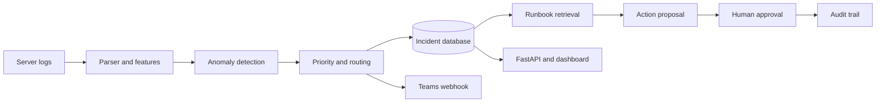

# Enterprise IT Incident Automation

[](https://github.com/Lonfea/enterprise-it-incident-automation/actions/workflows/ci.yml)
[](https://www.python.org/)
[](https://fastapi.tiangolo.com/)
[](https://www.docker.com/)
[](LICENSE)

An end-to-end IT operations workflow that turns server logs into prioritised, routed and SLA-tracked incidents. It combines anomaly detection, operational runbook retrieval, human approval and audit logging in a realistic demonstration of **enterprise AI automation, data engineering and service operations**.

## Business problem

Operations teams receive thousands of log events. Manual triage delays restoration and makes SLA breaches more likely. This system automates the first-response workflow while keeping every decision explainable.



## What is automated

- Parses semi-structured enterprise logs into consistent events.
- Parses three log formats (native, LogHub HDFS, LogHub BGL) with automatic detection.
- Uses transparent rules plus Isolation Forest to detect abnormal events.
- Learns from operator verdicts: templates repeatedly marked as false positives stop alerting.
- Classifies incidents into authentication, database, network, storage or application queues.
- Calculates severity from anomaly score, event level and repeated failures.
- Applies configurable SLA deadlines and highlights breaches.
- Retrieves evidence-based operational guidance from a versioned runbook library.
- Keeps remediation behind an explicit human approval or rejection step.
- Records status changes, proposals and decisions in an auditable event log.
- Sends an optional Microsoft Teams-compatible webhook notification.
- Exposes incidents through a REST API and an interactive dashboard.
- Runs quality checks automatically with GitHub Actions.

## Measured results

### Alert quality on real labelled logs

[LogHub BGL](https://github.com/logpai/loghub/tree/master/BGL) contains 2,000 Blue Gene/L supercomputer log lines with line-level anomaly labels (143 anomalies). The logs are split chronologically. The first half stands in for history that operators have already reviewed, and every detector is scored on the unseen second half (1000 lines, 47 anomalies).

| Detector | Alerts | Precision | Recall | F1 |
|---|---:|---:|---:|---:|
| v1 detector (rules OR isolation forest) | 333 | 0.14 | 1.00 | 0.25 |
| isolation forest only | 37 | 0.16 | 0.13 | 0.14 |
| refined rules only | 176 | 0.27 | 1.00 | 0.42 |
| current detector (refined rules OR gated isolation forest) | 178 | 0.26 | 1.00 | 0.42 |
| current detector + operator feedback | 178 | 0.26 | 1.00 | 0.42 |

What the numbers show:

- **The refined rules halve alert volume without missing anything.** The v1 detector alerted on any line containing a failure keyword, including INFO lines such as "parity error detected and corrected". Now INFO lines never alert on keywords alone, and self-corrected errors are skipped.
- **Isolation Forest is weak on its own here.** It finds 13% of anomalies. It stays in the pipeline as a secondary signal for WARN-or-higher events that no rule matches, and it contributes to priority. On this dataset it adds 2 alerts and no extra detections.
- **Operator feedback had no effect on this sample.** It learned 15 noise templates (CPU register dumps) from the first half, but none of them recur in the second half. The remaining false positives are templates never seen before. Feedback needs more history than 1,000 lines to pay off.
- **Precision is still low (0.26).** In BGL, many FATAL events are normal (for example, jobs failing to load a program image), and severity alone cannot separate them from hardware faults. Closing that gap needs labelled history or per-component rules, not a lower threshold.

The rule refinements came from error analysis on this same sample, so treat these numbers as indicative, not as an independent benchmark. Reproduce them with:

```bash
python scripts/benchmark_bgl.py --output evaluation/bgl_benchmark.json
```

### Routing and runbook retrieval

`scripts/evaluate.py` checks routing, priority and runbook retrieval on 10 hand-written scenarios, and currently scores 100% on all three. These are curated examples written alongside the rules, so they work as a regression check, not a benchmark.

### Tests

25 automated tests cover log parsing for all three formats, alert rules, feedback suppression, the ingestion pipeline (duplicates, webhook outages, source timestamps), runbook retrieval and the approval API.

## Data

The included sample makes the repository runnable immediately. The pipeline also reads two public [LogHub](https://github.com/logpai/loghub) formats, detected automatically:

| Format | Example source | Notes |
|---|---|---|
| `native` | `data/sample_system.log` | `YYYY-MM-DD HH:MM:SS LEVEL service - message` |
| `hdfs` | LogHub HDFS (Hadoop cluster) | no labels; used to check parsing and alert volume |
| `bgl` | LogHub BGL (Blue Gene/L) | line-level anomaly labels; used for the benchmark |

```bash
python scripts/download_hdfs.py
python -m src.pipeline --input data/HDFS_2k.log          # format detected automatically
python -m src.pipeline --input data/BGL_2k.log --format bgl
```

Lines that match no format are kept as `WARN` events with `parsed=False` and counted in the run summary, so malformed input is visible instead of silently dropped.

Dataset source: [LogPAI/LogHub](https://github.com/logpai/loghub)

## Quick start

```bash
python -m venv .venv
source .venv/bin/activate
pip install -r requirements.txt
python -m src.pipeline --input data/sample_system.log
uvicorn src.api:app --reload
```

In a second terminal:

```bash
streamlit run dashboard/app.py
```

- API documentation: `http://localhost:8000/docs`
- Dashboard: `http://localhost:8501`

Or run everything with Docker:

```bash
docker compose up --build
```

Docker Compose starts PostgreSQL, the API and the Streamlit dashboard. SQLite remains the zero-infrastructure default when running the Python commands directly.

## API examples

```bash
curl http://localhost:8000/health
curl "http://localhost:8000/incidents?status=open&priority=P1"
curl -X PATCH http://localhost:8000/incidents/1/status \
  -H "Content-Type: application/json" \
  -d '{"status":"resolved"}'

# Retrieve the most relevant runbook guidance
curl http://localhost:8000/incidents/1/guidance

# Propose a remediation; the action remains pending
# Tell the system whether the incident was real (feeds alert suppression)
curl -X POST http://localhost:8000/incidents/1/feedback \
  -H "Content-Type: application/json" \
  -d '{"verdict":"false_positive","actor":"on-call-engineer"}'

curl -X POST http://localhost:8000/incidents/1/actions \
  -H "Content-Type: application/json" \
  -d '{"action":"Restart the connection pool","rationale":"Saturation persists after read-only checks","requested_by":"assistant"}'

# A named human approves or rejects it
curl -X POST http://localhost:8000/actions/1/decision \
  -H "Content-Type: application/json" \
  -d '{"decision":"approved","decided_by":"on-call-engineer","reason":"Change window confirmed"}'
```

## Architecture decisions

| Decision | Reason |
|---|---|
| Rules first, ML second | Measured on BGL, rules catch every labelled anomaly while Isolation Forest alone finds 13%. |
| Template-level feedback | Operators judge alerts, not lines; masking variable tokens lets one verdict cover a class of messages. |
| Zero-tolerance suppression | A template with any confirmed incident keeps alerting; missing an outage costs more than one extra alert. |
| SQLite by default | Recruiters can run the demo without infrastructure. |
| PostgreSQL-ready SQLAlchemy | The same data model can support production deployment. |
| Optional webhook | Demonstrates integration without requiring private credentials. |
| Configurable SLA policy | Separates operational policy from application code. |
| TF-IDF runbook retrieval | Keeps the demo local, deterministic and testable without private API keys. |
| Human approval gate | AI suggests evidence-based next steps but never executes remediation. |
| Append-only audit events | Makes operational decisions traceable for review and governance. |

Set `DATABASE_URL` to a PostgreSQL connection string or `TEAMS_WEBHOOK_URL` to enable notifications. Never commit credentials.

## Repository structure

```text
src/                 parsing, detection, feedback, retrieval, persistence and API
dashboard/           Streamlit operations dashboard
scripts/             dataset download, curated evaluation and BGL benchmark
tests/               automated tests
data/                 small runnable demonstration log
evaluation/           benchmark and validation reports
docs/                 design notes and known limitations
.github/workflows/    continuous integration
```

## Responsible use

The system supports human operators; it does not autonomously execute remediation commands. Every proposed action starts in a pending state and requires a named human decision. Production use would additionally require authentication and role-based access, encrypted secrets, drift monitoring, organisation-specific validation and independent security review.

## Roadmap

- Add live Kafka/MQTT ingestion
- Connect Microsoft Graph/ServiceNow sandbox adapters
- Evaluate feedback suppression on a longer labelled history (full BGL, 4.7M lines)
- Group repeated alerts into one incident per template and time window
- Add model drift monitoring
- Package an infrastructure-as-code deployment

## Author

**Berkant Duman** — MSc student in Business Management, Data Analytics and Artificial Intelligence at Steinbeis University, Berlin.

## License

MIT
