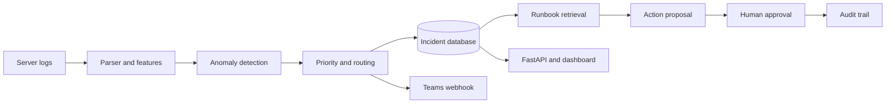

# Enterprise IT Incident Automation

[](https://github.com/Lonfea/enterprise-it-incident-automation/actions/workflows/ci.yml)
[](https://www.python.org/)
[](https://fastapi.tiangolo.com/)
[](https://www.docker.com/)
[](LICENSE)

An end-to-end IT operations workflow that turns server logs into prioritised, routed and SLA-tracked incidents. It combines anomaly detection, operational runbook retrieval, human approval and audit logging in a realistic demonstration of **enterprise AI automation, data engineering and service operations**.

## Business problem

Operations teams receive thousands of log events. Manual triage delays restoration and makes SLA breaches more likely. This system automates the first-response workflow while keeping every decision explainable.



## What is automated

- Parses semi-structured enterprise logs into consistent events.
- Uses Isolation Forest plus transparent rules to detect abnormal events.
- Classifies incidents into authentication, database, network, storage or application queues.
- Calculates severity from anomaly score, event level and repeated failures.
- Applies configurable SLA deadlines and highlights breaches.
- Retrieves evidence-based operational guidance from a versioned runbook library.
- Keeps remediation behind an explicit human approval or rejection step.
- Records status changes, proposals and decisions in an auditable event log.
- Sends an optional Microsoft Teams-compatible webhook notification.
- Exposes incidents through a REST API and an interactive dashboard.
- Runs quality checks automatically with GitHub Actions.

## Portfolio evidence

- **6 automated tests** cover parsing, routing, anomaly scoring, runbook retrieval and the approval API.
- A reproducible evaluation script checks **routing, priority and runbook retrieval** across 10 labeled scenarios.
- The current curated validation report scores **100% on all three measures**. This is a transparent portfolio validation set, not a production benchmark.
- PostgreSQL, Docker Compose, FastAPI and GitHub Actions provide a production-shaped local environment.

Run the evaluation yourself:

```bash
python scripts/evaluate.py --output evaluation/report.json
```

## Data

The included sample makes the repository runnable immediately. For a real operational benchmark, the downloader uses the **HDFS log dataset from LogHub**, collected from a Hadoop Distributed File System cluster rather than manufactured help-desk records.

```bash
python scripts/download_hdfs.py
python -m src.pipeline --input data/HDFS_2k.log
```

Dataset source: [LogPAI/LogHub](https://github.com/logpai/loghub)

## Quick start

```bash
python -m venv .venv
source .venv/bin/activate
pip install -r requirements.txt
python -m src.pipeline --input data/sample_system.log
uvicorn src.api:app --reload
```

In a second terminal:

```bash
streamlit run dashboard/app.py
```

- API documentation: `http://localhost:8000/docs`
- Dashboard: `http://localhost:8501`

Or run everything with Docker:

```bash
docker compose up --build
```

Docker Compose starts PostgreSQL, the API and the Streamlit dashboard. SQLite remains the zero-infrastructure default when running the Python commands directly.

## API examples

```bash
curl http://localhost:8000/health
curl "http://localhost:8000/incidents?status=open&priority=P1"
curl -X PATCH http://localhost:8000/incidents/1/status \
  -H "Content-Type: application/json" \
  -d '{"status":"resolved"}'

# Retrieve the most relevant runbook guidance
curl http://localhost:8000/incidents/1/guidance

# Propose a remediation; the action remains pending
curl -X POST http://localhost:8000/incidents/1/actions \
  -H "Content-Type: application/json" \
  -d '{"action":"Restart the connection pool","rationale":"Saturation persists after read-only checks","requested_by":"assistant"}'

# A named human approves or rejects it
curl -X POST http://localhost:8000/actions/1/decision \
  -H "Content-Type: application/json" \
  -d '{"decision":"approved","decided_by":"on-call-engineer","reason":"Change window confirmed"}'
```

## Architecture decisions

| Decision | Reason |
|---|---|
| Hybrid ML + rules | Anomaly scores provide coverage; rules make routing auditable. |
| SQLite by default | Recruiters can run the demo without infrastructure. |
| PostgreSQL-ready SQLAlchemy | The same data model can support production deployment. |
| Optional webhook | Demonstrates integration without requiring private credentials. |
| Configurable SLA policy | Separates operational policy from application code. |
| TF-IDF runbook retrieval | Keeps the demo local, deterministic and testable without private API keys. |
| Human approval gate | AI suggests evidence-based next steps but never executes remediation. |
| Append-only audit events | Makes operational decisions traceable for review and governance. |

Set `DATABASE_URL` to a PostgreSQL connection string or `TEAMS_WEBHOOK_URL` to enable notifications. Never commit credentials.

## Repository structure

```text
src/                 parsing, detection, retrieval, persistence and API
dashboard/           Streamlit operations dashboard
scripts/             real dataset downloader
tests/               automated tests
data/                 small runnable demonstration log
evaluation/           reproducible validation report
.github/workflows/    continuous integration
```

## Responsible use

The system supports human operators; it does not autonomously execute remediation commands. Every proposed action starts in a pending state and requires a named human decision. Production use would additionally require authentication and role-based access, encrypted secrets, drift monitoring, organisation-specific validation and independent security review.

## Roadmap

- Add live Kafka/MQTT ingestion
- Connect Microsoft Graph/ServiceNow sandbox adapters
- Add operator feedback and model drift monitoring
- Package an infrastructure-as-code deployment

## Author

**Berkant Duman** — MSc student in Business Management, Data Analytics and Artificial Intelligence at Steinbeis University, Berlin.

## License

MIT
